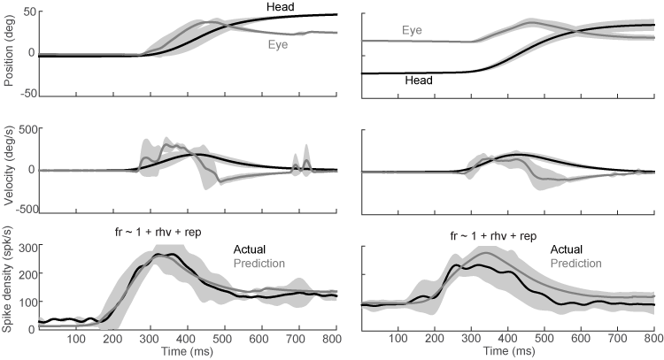

#Introduction
Humans and other primates use combinations of eye and head movements to move the line of sight. Depending on the behavioral task, different types of movements may be employed. Gaze shifts are used to quickly acquire a new target using a rapid head rotation combined with a saccadic eye movement. Gaze pursuit can be used to follow a moving target and combines head rotation with smooth pursuit eye movements. These behaviors are often used in combination to efficiently view objects of interest within the natural world. 
 
Investigations of the neural correlates of these behaviors reveal that separate neural mechanisms are employed. The superior colliculus (SC) is a key structure in the control of gaze shifts. Experimental evidence demonstrates that the SC contains an organized motor map that represents a desired gaze displacement signal used to generate gaze shifts. No analogous organized structure has been identified for pursuit movements. Instead, pursuit seems to be controlled by a reciprocal cerebro-ponto-cerebellar circuit. This circuit includes areas of visual motion processing and the frontal eye fields in the cortex, pontine nuclei that relay these signals to the cerebellum and follicular neurons, which are likely to be responsible for generating smooth pursuit eye movements. Although there is evidence of gaze-related signals at each stage in this circuit, it has not been demonstrated that these commands are used to generate head movements during pursuit.
 
The identification of brain regions responsible for decomposing gaze signals into the appropriate eye and head motor commands is an ongoing scientific pursuit. The technique of restraining the head has allowed researchers to understand the pathways driving eye and gaze movements, but does not distinguish between the two. When the head is free to move, behavioral paradigms can be employed to dissociate gaze from eye-related signals. This, combined with head-restrained studies, has allowed for significant progress in the mapping of the oculomotor premotor circuits. A similar method can be used to map the premotor circuits responsible for driving head movements.
 
Anatomic evidence exists for the neurophysiologic basis of head control in gaze shifts. In particular, some neurons in the reticular formation receive inputs from the SC and project to motor neurons in the cervical spinal cord.   This places them in the ideal location to transform gaze displacement signals from the SC into appropriate head motor commands, though the activity of these neurons has not been described in primates performing head-unrestrained movements.
 
Recordings from the medullary and pontine reticular formation in cats have identified some neurons with activity correlated with certain dynamics of head movement (Isa and Naito 1995).  Micro-stimulation of analogous structures in monkeys has been shown to produce movements of the eyes, head, ears, mouth and produce other movements, depending on the region stimulated (Quessy and Freedman 2004). Quessy and Freedman (2004) investigated a region of NRG that produces ipsilateral horizontal head rotation when stimulated, with kinematics similar to those observed during horizontal gaze shifts. They further demonstrated that while stimulating these regions does not produce eye movement directly, stimulation does alter ongoing eye movements initiated as part of a gaze shift (Freedman and Quessy 2004), implying that NRG is part of the circuit used to produce gaze shifts.
 
In addition to likely gaze-shift-related inputs from the SC, the NRG also receives input from many other areas, including motor and prefrontal cortex, the cerebellum and basal ganglia. This diversity of inputs suggests the potential for a greater role for NRG, including the potential for involvement in producing the head movements associated with gaze pursuit. Cats do not employ smooth pursuit movements like humans and monkeys do, so the neurophysiology of this region will require recording in the primate.
 
In this study, we return to the portion of NRG stimulated by Quessy and Freedman to record the activity of neurons that may be responsible for producing the head movement observed during stimulation. We use established behavioral paradigms to dissociate gaze, eye and head movement during gaze shifts that allow us to identify neurons whose activity is associated with head movement apart from gaze or eye movements. New techniques for dissociating the gaze, eye and head  movements associated with gaze pursuit are also employed, enabling us to identify any neurons involved in producing the head movements associated with pursuit and to determine whether these are a separate population from those involved in producing head movements during gaze shifts. Our behavioral paradigms also allow us to assess neurons for activity related to eye position in the orbits. This is information required to produce a head-specific motor command from gaze-related signals.

#Methods
The two resus monkey subjects from chapter 1 also served as subjects in this experiment.

##Behavior Tasks
Subjects performed two interleaved tasks while we recorded the activity of isolted neurons in NRG. Both tasks began with subjects fixating on a central visual target, and aligning the head to one of three positions relative to the target

##Neurophysiology
Single neurons in NRG were isolated using a tungsten micro-electrode (Micro Probes), amplified, filtered and saved for offline analysis. The anterior/posterior position of the electrode in the chamber was chosen using the characteristic firing pattern of the abducens motor nucleus as a landmark. We close electrode tracts that traveled posterior to the nucleus to avoid damaging motor neurons, and continued deeper. On most tracts, the characteristic population bursting for ipsiversive gaze shifts of PPRF was noted, as well as occasional MLBs and LLBNs. Once the electrode was advanced beyond the level of population gaze-shift-related activity, we also characterized the location's response to micro-stimulation. We sought regions that produced horizontal head rotation on stimulation, using the stimulation parameters of Quessy and Freedman (2004) as a guide. Superficial to this region, we observed evoked ear movements as well as head movements with vertical or roll components. Any neurons isolated deep to the level of population gaze activity were recorded as a candidate for inclusion in this study. 

##Modeling
We are attempting to find a function of the recorded eye and head movements that will predict the firing rate of the neuron during the trial. We convert the recorded spike times into a continuous function by convolving them with a Gaussian with a 15ms standard deviation to create a spike density function. We scale the spike density function so that it approximates the firing rate in spikes per second. For this analysis, we separate leftward and rightward movements to produce 12 possible predictor variables: (right/left)(eye/head)(position/velocity/acceleration), represented by the abbreviations: *rhp, lhp, rep, lep, rhv, lhv, rev, lev, rha, lha, rea* and *lea*. 

We use Matlab’s **stepwiselm** function, beginning with a constant model. The function evaluates the set of available terms, which includes the predictor variables described above, as well as pairwise interactions. If any of these terms improve the R^2^ of the model by 0.05 or more, the threshold criterion we chose, it includes the best term and then repeats the evaluation to see if any other terms could improve the model further. If these neurons were involved in generating the observed eye and head behavior, we assume that there would be a time delay between neural activity and movement. We repeated this step-wise model fitting to shifted data, in 10ms increments up to 200ms. We employed step wise fitting method to find the best fit at each location independently. We then chose the delay that gave the best fit, determined by the R^2^ weighted by the number of terms in the model. Each additional term must improve the fit by at least 0.05. For example, if the best fit at a 50ms delay was a model with two terms an R^2^ of 0.29, and the best fit at 60ms was a model with three terms and an R^2^ of 0.30, we chose the simpler model.


`r library(knitr)` `r opts_chunk$set(cache=FALSE,echo=FALSE)`

```{r loadlibraries, cache=FALSE,message=FALSE,warning=FALSE,echo=FALSE}
#in this chunk we load the required libraries and import the .csv files containing the data output from our Matlab analyses. 
library(knitr)
library(ggplot2)
library(dplyr)
library(tidyr)
library(xtable)
```

```{r loadCSV}
filename<-"~/MATLAB/NeurophysNRG/bestFitLRResort.csv"
d <- read.csv(filename, na.strings="NaN")
r<-read.csv('~/MATLAB/NeurophysNRG/RCode/peakregressions.csv')
gs<-read.csv('~/MATLAB/NeurophysNRG/fitGSPlm.csv')
r<-r[,2:12]
p<-read.csv('~/MATLAB/NeurophysNRG/peakAnalysis.csv',na.strings="NaN")
source('~/MATLAB/NeurophysNRG/RCode/StatSmoothFunc.R') #function to add formula to regression
```

```{r Signficance,echo=FALSE}
#In this chunk, we're doing statistical tests to identify cells with signficant correlations between peak head velocity and peak firing rate (p values stored in p.right and p.left). We are also identifying cells with an effect of trial type (noticing if the slope or intercept is significant for the interaction). 
p$Task<-as.factor(p$isgs)
levels(p$Task)<-c('Pursuit','Gaze Shift')
p$maxsdf<-p$maxsdf*1400 #scale to spikes/s 

p %>%
  group_by(Neuron) %>%
  do(right.model=summary(lm(maxsdf~head_peak,data=filter(.,head_peak>20))),
     left.model =summary(lm(maxsdf~head_peak,data=filter(.,head_peak< -20)))) %>%
  mutate(r.right=right.model$r.squared,
            r.left=left.model$r.squared,
            slope.right=right.model[[4]][2],
            slope.left=left.model[[4]][2],
            intercept.right=right.model[[4]][1],
            intercept.left=left.model[[4]][1],
            p.right=right.model[[4]][8],
            p.left=left.model[[4]][8]) %>%
  select(-2,-3)->
  mm

pp<-merge(p,mm,by='Neuron')

n.total<-length(unique(pp$Neuron))

```

#Results
We isolated 163 neurons (94 from S and 69 from U) in our target region while monkeys performed head-unrestrained gaze shifts and gaze pursuit tasks. This report includes a detailed analysis of 51 of these neurons,  chosen based on apparent task-related activity while the monkey completion of at least 30 trials randomly selected from our two task types.

##Influence of Head Velocity
We find that the activity of many of these neurons is related to the velocity of the head as it contributes to gaze movement. In Figure 1, we show scatter plots comparing the peak head velocity with the peak firing rate of some example cells in our data set. Data from the entire data set appears in Supplementary Figure 1 at the end of this document. Each point represents a single successful trial and both task types are included. It appears that peak firing rate increases linearly with peak head velocity, but often only in a single direction. 

```{r exampleCells, fig.width=9,fig.height=11}
#In this figure, we're showing all the cells with significant regressions for leftward movements
qplot(head_peak,maxsdf,alpha=I(0.5),
      data=filter(pp,r.left>0.4 | r.right>0.4))+
  facet_wrap(~Neuron,ncol=3)+
  theme_bw()+
  ylab('Peak Firing Rate (spikes/s)')+
  xlab('Peak Head Velocity (deg/s)')
```

We calculate the least squares regression line for this relationship in each direction for all of the neurons shown in Figure 1. We test the significance of this regression line using a t-test against the null hypothesis that the slope is zero, indicating no relationship. With a significance threshold of p<0.001, we find 20 cells with significant regressions for leftward head movements, 20  for rightward, and nine for movements in either direction. Table 1 shows the result of this analysis for the 10 cells with best fits. Results from all cells are included in Supplementary Table 1. We plot the least squares regression lines on the same axes for all of the cells with significant regressions in at least one direction in Figure 2.

```{r regressionTable}
mm %>%
  mutate(max.r=max(r.left,r.right)) %>%
  arrange(desc(max.r))->
  tpeak
#convert to numeric columns. do returns a list
  tpeak[-1]<-sapply(tpeak[-1],unlist)
  kable(tpeak[1:10,1:length(tpeak)-1],digits=3,align='l')
```


More evidence of head velocity-related activity appears in the results of the stepwise linear modeling analysis. As described in *Methods*, we construct models to predict the firing rate of each cell. We began with a constant model and programmatically added terms to the model that improved the R^2^ by at least 0.5. Possible terms included the position, velocity and acceleration of the eyes or head in either direction. This gave a total of 12 terms that could potentially be included. We allowed for the inclusion of first-order interactions but no interactions improved models enogh to be included. With these criteria, leftward head velocity was a component in the models of 30 neurons and rightward head velocity was included in 29.  Figure 2 shows the frequency with which the 12 potential terms were included in any models. 

```{r coefCounts,warning=FALSE,message=FALSE,echo=FALSE}

d %>% 
  select(rhv:lea) %>% 
  mutate_each(funs(!is.na(.))) %>%
  summarise_each(funs(sum)) %>% 
  gather('c','n',1:12) %>%
  mutate(c=reorder(c,desc(n))) ->
  s

qplot(y=n,x=s$c,geom='bar',stat='identity',data=s)+
  xlab('Variable')+ylab('Count')+
  theme_bw()+
  theme(axis.text.x=element_text(size=18,angle=45, hjust=1))

```

##Factors other than Head Velocity
From the histogram in Figure 2, it is clear that head velocity is the most important factor for predicting the firing rate of the neurons, but other terms are also included for some cells. Neither eye velocity nor acceleration are included in any models, and head acceleration is included in only one. However, there are a number of neurons with a term related to the position of the head or the positions of the eyes in the orbits. Although the best fit for three neurons included only terms related to position, the rest have position terms in addition to head velocity. We show the results of the stepwise regression modeling for the ten cells with the best fit in Table 2. Results from all neurons are shown in Supplementary Table 2.

```{r formulatable}
tab<-xtable(d[,1:4],caption='This table shows the results of a step-wise fitting procedure that with a threshold for inclusion of an increase of 0.5 in the R2')
#print(tab,comment=FALSE)
kable(d[1:10,1:4],digits=2,align='l')
```

###Static Position-Related Activity
Eye and head position are often correlated, so we include an additional analysis to determine what best explains the position-related activity observed in some cells. The design of our gaze shift task required subjects to initially maintain gaze fixation on a centrally located visual target with the eyes and head in one of three horizontal configurations. After the gaze shift, subjects were required to maintain gaze fixation of the second visual target without any further requirement for eye and head position. This enables us to dissociate eye and head position during fixations. Figure 3 shows a neuron with activity related to eye position. In the left panel, notice the activity after the gaze shift while the eyes and head are both to the right. In the right panel, we dissociate eye and head position during the fixation before the gaze shift and observe similar activity while the eyes are to the right in the orbits and the head is pointed leftward, indicating the activity is related to the rightward position of the eyes. This figure also shows the prediction of the model incorporating two terms: rightward head velocity and rightward eye position. 



In order to assess the effect of eye and head position systematically,  we limited trials to only the periods of fixation before and after gaze shifts, then fit a model with four terms, leftward and rightward eye and head position.  This allowed us to determine how much each term contributes to the activity observed during fixation. When interpreting the mathematical models in terms of behaviors contributing to the neural activity, it is more useful to describe the activity as being related to rightward eye position, rather than negatively correlated with leftward eye position or rightward head position. In Table 3, we show the results of this regression, highlighting the term that contributes the most in terms of spikes/s per deg/s.

```{r staticTable,echo=FALSE,fig.width=6}
staticBestFitLR <- read.csv("~/MATLAB/NeurophysNRG/Resort/staticBestFitLR.csv", na.strings="NaN")

staticBestFitLR %>%
  select(1:7) %>%
  rename(Rightward.Eye=rep,Leftward.Eye=lep,Rightward.Head=rhp,Leftward.Head=lhp) %>%
  gather('coef','b',4:6) %>%
  group_by(Neuron) %>%
  summarise(Position.Type=coef[b==max(b)],rsquared=max(rsquared),Coefficient=max(b)) %>%
  arrange(desc(rsquared))-> tstatic
kable(tstatic,digits=2,align='l')
```

##Task-Related Activity
The relatioship between firing rate and head velocity was largely consistent regardless of the task being performed. During the delayed gaze shift task, subjects typically executed a single, large gaze shift with varying head movements, depending on the amplitude of the movement and initial positions of the eyes in the orbits.  During the visual pursuit task, subjects performed smooth gaze pursuit, with head movements driven by the velocity of the visual target and the initial positions of the eyes in the orbits. We did not record any neurons with activity limited to one behavior type. In the figure below, we compare the relationship between peak firing rate and the peak head velocity during the two tasks. 

```{r examplegsps, fig.width=9,fig.height=11}
#In this figure, we're showing all the cells with significant regressions for leftward movements
qplot(head_peak,maxsdf,col=Task,shape=Task,alpha=I(0.5),
      data=filter(pp,r.left>0.4 | r.right>0.4))+
  facet_wrap(~Neuron,ncol=3)+
  ylab('Peak Firing Rate (spikes/s)')+
  xlab('Peak Head Velocity (deg/s)')
```

We investigate the impact of task type on the relationship between the peak head velocity and peak firing rate of the cell using ANCOVA by fitting the model $$Fr_{peak} = x_{0}+x_{1} H_{peak}+x_{2} T_{type}+x_{3} H_{peak}*T_{type},$$ where $Fr_{peak}$ is the peak firing rate, $H_{peak}$ is the peak head velocity, and $T_{type}$ is the task  (delayed gaze shift or head-unrestrained pursuit) that was performed during each trial,and the $*$ indicates an interaction between the two parameters. For this analysis, we omitted trials where the peak head velocity did not exceed 40 deg/s, because we did not have an equal sampling of trials with little head movement from both task types. Using a threshold of p < 0.001, we identified cells for which we should reject the null hypothesis that the task is irrelevant for predicting the firing rate, once the head velocity is known. We show the cells meeting these criterea below.


```{r GSPS}
p %>%
  filter(maxsdf>10) %>%
  group_by(Neuron) %>%
  do(right.model=summary(lm(maxsdf~head_peak*Task,
                            data=filter(.,head_peak>50))),
     left.model =summary(lm(maxsdf~head_peak*Task,
                            data=filter(.,head_peak< -50)))) %>%
  mutate(p.left.slope=left.model[[4]][16],
         p.left.int=left.model[[4]][[15]],
         p.right.slope=right.model[[4]][16],
         p.right.int=right.model[[4]][15],
         p.right=right.model[[4]][14],
         p.left=left.model[[4]][14]) %>%
  select(-2,-3) %>%
  merge(p,.,by='Neuron') ->
gsps


```

```{r gspsplots,fig.width=9}

rcells<-filter(gsps,p.right<0.001,p.right.int<0.001 | p.right.slope <0.001)
lcells<-filter(gsps,p.left<0.001,p.left.int<0.001 | p.left.slope<0.001)
rlcells<-rbind(rcells,lcells)

qplot(head_peak,maxsdf,col=Task,shape=Task,alpha=I(0.5),
      data=filter(rcells,head_peak>40))+
        facet_wrap(~Neuron)+
        stat_smooth(method='lm')
qplot(head_peak,maxsdf,col=Task,shape=Task,alpha=I(0.5),
      data=filter(lcells,head_peak< -40))+
  facet_wrap(~Neuron)+
  stat_smooth(method='lm')

```

When we compare the cells identified using this method with the formula that these neurons were assigned during the multiple regression analysis, we can see that 3/4 of the cells have an additional factor besides head velocity that may explain why head velocity is insufficient to predict activity. The other cell cannot be explained in this fashion, but the firing rate overall is low (<100 spikes/s) and the R^2^ of the fit for this cell is only 0.2. 


```{r gspsformulae,warning=FALSE,message=FALSE}

rlf<-inner_join(rlcells,d) # join this with the table with multiple regressions
rlf %>% 
  select(c(Neuron,rsquared,f)) %>% 
  group_by(Neuron) %>% 
  summarize(formula=f[1],R.squared=rsquared[1]) -> #summarize just the formula for each neuron
  gspstable

kable(gspstable)
```

#Discussion
In this experiment, we examined the activity of neurons in a head movement-related area of the monkey brainstem: the nucleus reticularis gigantocellularis (NRG).  We recorded the firing patterns of individual neurons in this region while subjects performed head-unrestrained gaze movements, which included gaze shifts and gaze pursuit. Subjects performed these movements using two behavioral tasks, a standard delayed gaze shift task (See: Freedman and sparks 1997, Walton and Freedman 2014), and a visual tracking task that subjects accomplished using a combination of smooth gaze pursuit and catch-up saccades (gaze shifts).  We used established behavioral paradigms to dissociate head, eye and gaze velocity by controlling the initial positions of the eyes in the orbits. This provided us with a data set that includes gaze shifts and pursuit movements with a range of contributing head movements. 
 
Our interest in the activity of the NRG is derived largely from the effort to identify neural correlates of eye-head coordination, particularly the regions involved in transforming gaze signals into individual eye and head motor commands. The activity of the superior colliculus (SC) has been well documented during head unrestrained gaze shifts. The deeper layers of the SC have been shown to encode a gaze displacement signal, corresponding to the amplitude of the gaze shift without regard for the combination of eye and head movements that are used to execute it (Freedman and Sparks 1997). This implies that regions downstream from the SC transform this gaze amplitude information into appropriate eye and head motor commands.
 
Consistent with the predictions from anatomy, microstimulation and recordings in cats, we find strong evidence of activity related head movement in the neurons we recorded. The peak firing rate of the majority of neurons was significantly correlated with peak head velocity for movements in at least one direction. Although head and eye movements may be correlated, we show through stepwise multiple linear regression that head velocity is the most important factor for predicting firing rate in most of our neurons. Eye velocity is not an important factor in any of the neurons in our data set, but we intentionally attempted to record from neurons with head -related activity, so this should not be taken as a random sample of neurons within NRG. Consistent with the hypothesis that activity in this region could be driving head movements, we observe head-velocity-related activity that precedes the observed movements, although there is significant variability of this latency between neurons. It is possible that these differences latency could be due to recruitment of motor neurons in different phases of the head movement.
 
The head-movement-related activity that we observed was not restricted to head movements made during gaze shifts. We observe similar head-movement-related activity during head movements made as part of gaze pursuit. This suggests that the NRG is not dependent on the SC to participate in generating head movement. The NRG could represent a region shared by the saccadic gaze shift and smooth gaze pursuit pathways, which otherwise depend on largely segregated circuits.  For the majority of neurons we recorded, we did not detect any significant influence of task type on the relationship between the firing rate and velocity of the head, but such differences were apparent in a minority of cells. We show this in figure \ref{gs/pscomparison} where we compare the peak firing rate to peak velocity. For some cells, the statistical differences may be due to an uneven distribution of head velocities, but others show quite dramatic differences which warrant further investigation. Multiple regression analysis indicated that these differences could not be explained by sensitivity to head acceleration or any parameters of eye movement, which are known to differ between gaze shifts and pursuit.  It is possible that this subset of neurons is sensitive to another aspect of the movement that we did not record, such as head roll, or the activity could be related to something other than movement. Another possibility is that the difference in activity is really due to differences in how the circuits involved in generating each movement type incorporates the NRG in the generation of head movements. For example, the NRG  may not be the only  input to the neck motor neurons active during  pursuit or gaze shifts. If an additional premotor areas are recruited by one behavior type, that could account for the differences observed, although this does not explain why this effect would only appear in a minority of neurons.
 
In addition to head velocity, we also found activity related to eye and head position in our neurons. Neurons with head position related activity could participate in maintaining the head in an eccentric position by activating the same target neurons involved in generating head movements. Our data set does not include neurons with eye velocity related activity, but we do find some cells with eye position related activity, often together with head velocity related activity. Even though this region of the NRG does not seem to be involved in generating eye movements, information about the positions of the eyes in the orbits is essential for generating the appropriate head movement in response to a particular gaze displacement signal from the SC. We have also recently shown that this information is also essential to generate appropriate head movements in response to moving visual targets as part of gaze pursuit. The existence of this information encoded by neurons in the NRG provides further support for the hypothesis that the NRG is responsible for generating head movement commands as part of coordinated eye-head movements.

##Supplementary Figures

```{r peakAnalysisDUMP,fig.width=9, fig.height=30,echo=FALSE}
neurons<-levels(p$Neuron)
n.neurons<-length(neurons)
qplot(head_peak,maxsdf,alpha=I(0.5),data=p)+
  facet_wrap(~Neuron,ncol=3)+
  ylab('Peak Firing Rate (spikes/s)')+
  xlab('Peak Head Velocity (deg/s)')
p1<-subset(p,Neuron %in% neurons[1:18])
p2<-subset(p,Neuron %in% neurons[19:36])
p3<-subset(p,Neuron %in% neurons[37:n.neurons])
#p4<-subset(p,Neuron %in% neurons[46:n.neurons])
#qplot(head_peak,maxsdf,data=p1)+
#  facet_wrap(~Neuron,ncol=3)+
#  ylab('Peak Firing Rate (spikes/s)')+
#  xlab('Peak Head Velocity (deg/s)')
#qplot(head_peak,maxsdf,data=p2)+
#  facet_wrap(~Neuron,ncol=3)+
#  ylab('Peak Firing Rate (spikes/s)')+
#  xlab('Peak Head Velocity (deg/s)')
#qplot(head_peak,maxsdf,data=p3)+
#  facet_wrap(~Neuron,ncol=3)+
#  ylab('Peak Firing Rate (spikes/s)')+
#  xlab('Peak Head Velocity (deg/s)')
#qplot(head_peak,maxsdf*1400,data=p4)+
#  facet_wrap(~Neuron,ncol=3)+
#  ylab('Peak Firing Rate (spikes/s)')+
#  xlab('Peak Head Velocity (deg/s)')
  
```

```{r fullRegressTable}
kable(tpeak[,1:length(t)-1],digits=3,align='l')
```

```{r fullformulatable}
tab<-xtable(d[,1:4],caption='This table shows the results of a step-wise fitting procedure that with a threshold for inclusion of an increase of 0.5 in the R2')
#print(tab,comment=FALSE)
kable(d[,1:4],digits=2,align='l')
```

```{r gspsfull,fig.width=9, fig.height=30}
qplot(head_peak,maxsdf,color=Task,alpha=I(0.5),data=p)+
  facet_wrap(~Neuron,ncol=3)+
  ylab('Peak Firing Rate (spikes/s)')+
  xlab('Peak Head Velocity (deg/s)')+
  theme(legend.position='bottom')
```