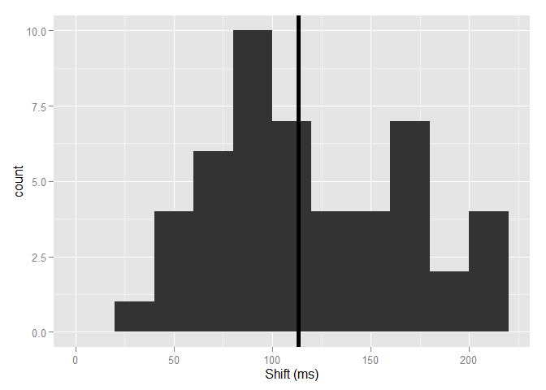
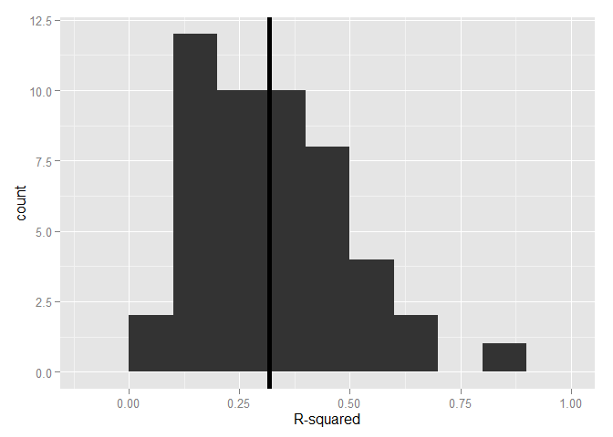
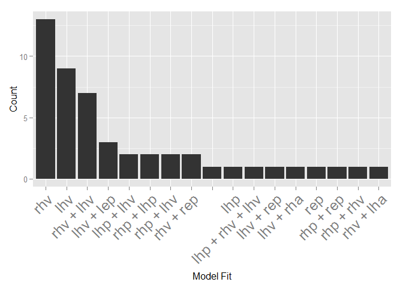

# Modeling Activity of Neurons from NRG recording study
##Introduction
##Methods
We are attempting to find a function of the recorded eye and head movements that will predict the firing rate of the neuron during the trial. We convert the recorded spike times into a continuous function by convolving them with a Gaussian with a 15ms standard deviation to create a spike density function. We scale the spike density function so that it approximates the firing rate in spikes per second. For this analysis, we separate leftward and rightward movements to produce 12 possible predictor variables: (right/left)(eye/head)(position/velocity/acceleration), represented by the abreviations: *rhp, lhp, rep, lep, rhv, lhv, rev, lev, rha, lha, rea* and *lea*. 

We use Matlab’s **stepwiselm** function, beginning with a constant model. The function evaluates the set of available terms, which includes the predictor variables described above, as well as pairwise interactions. If any of these terms improve the R2 of the model by 0.05 or more, the threshold criterion we chose, it includes the best term and then repeates the evaluation to see if any other terms could improve the model further. If these neurons were involved in generating the observed eye and head behavior, we assume that there would be a time delay between neural activity and movement. We repeated this stepwise model fitting to shifted data, in 10ms increments up to 200ms. We employed stepwise fitting method to find the best fit at each location independently. We then chose the delay that gave the best fit, determined by the $R^2$ weighted by the number of terms in the model. Each additional term must improve the fit by at least 0.05. For example, if the best fit at a 50ms delay was a model with two terms an $R^2$ of 0.29, and the best fit at 60ms was a model with three terms and an $R^2$ of 0.30, we chose the simpler model.

##Results


```r
library(ggplot2)
library(dplyr)
library(tidyr)
filename<-"~/MATLAB/NRGRecording/bestFitLR.csv"
d <- read.csv(filename, na.strings="NaN")
```


```r
qplot(d$shift,binwidth=20,xlab='Shift (ms)')+geom_vline(xintercept=mean(d$shift),size=2)
```

 

The average shift was 113.27ms, with a standard deviation of 49.09. 


```r
qplot(d$rsquared,binwidth=0.1,xlab='R-squared')+geom_vline(xintercept=mean(d$rsquared),size=2)
```

 


The average $R^2$ was 0.32, with a standard deviation of 0.17.


Regarding the final best-fit formulas from our 49 neurons, 25 models included rightward head velocity, 26 included leftward head velocity and 8 included head velocity in both directions. Similarly, 5 models included rightward eye position, 3 included leftward eye position and 0 included eye position in both directions. 

Of the 8 models that included an eye position component, 6 also indluded a head velocity component and 2 did not. 


```r
d$f<-as.character(d$f)
d$f<-substr(d$f,start=9,stop=nchar(d$f))
d$f<-as.factor(d$f)
q<- d %>%
  group_by(f) %>%
  summarize(Count=n())

q$f<-reorder(q$f,desc(q$Count))
p <- ggplot(q, aes(y=Count)) + theme(axis.text.x=element_text(size=18,angle=45, hjust=1))
p+geom_bar(aes(x=f),data=q,stat='identity')+ylab('Count')+xlab('Model Fit')
```

 

From this, we see that head velocity alone is a common fit. Also prevailent are combinations including head velocity and either eye or head position. 


```r
s<-d %>% 
  select(18:29) %>% #these are the count columns I made two chunks ago
  summarise_each(funs(sum)) %>% 
  gather('c','n',1:12)

s$c<-s$c %>% 
  as.character() %>% 
  substr(.,start=1,stop=3) %>% #just take the first three letters 
  as.factor(.) %>%
  reorder(desc(s$n)) #order by count

p<-ggplot(aes(y=n),data=s)+theme(axis.text.x=element_text(size=18,angle=45, hjust=1))
p+geom_bar(aes(x=s$c),stat='identity')+xlab('Coefficient')+ylab('Count')
```

 

Next, we show how many times each term was included in a model. Left and right head velocity shows up the most often, followed by head position and eye position. Leftward and Rightward head acceleration were each included just once and eye velocity or acceleration was not included in any models. 
