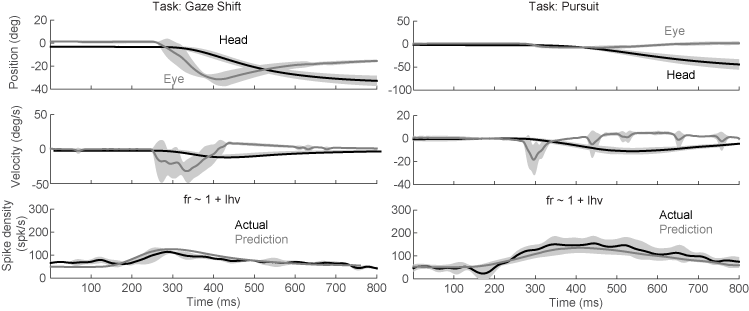

#Results
We isolated 163 neurons (94 from S and 69 from U) in NRG while monkeys performed head-unrestrained gaze shifts and gaze pursuit tasks. We chose 51 of these neurons for further analysis in this report, based on apparent head-movement-related activity as perceived by the researchers during recording, and the recording of at least 50 successful trials while isolation was maintained. The behavior tasks that our monkeys performed provided us with a large variety of head movements to investigate. Controlling initial eye position provided us with examples of pursuit and gaze shifts of similar velocities and amplitudes with varying amounts of head contribution. This provided us with the ability to identify neurons with head-related activity during recording. For offline analysis, we can compare the firing rate of the neurons to the actual head and eye kinematics on a trial-by-trial basis. While our focus was on horizontal movements, we recorded the vertical positions of the gaze, eyes and head at all times. 

`r library(knitr)` `r opts_chunk$set(cache=FALSE,echo=FALSE)`

```{r load csv, cache=FALSE,message=FALSE,warning=FALSE,echo=FALSE}
#in this chunk we load the required libraries and import the .csv files containing the data output from our Matlab analyses. 
library(knitr)
library(ggplot2)
library(dplyr)
library(tidyr)
library(xtable)
filename<-"~/MATLAB/NeurophysNRG/bestFitLRResort.csv"
d <- read.csv(filename, na.strings="NaN")
r<-read.csv('peakregressions.csv')
gs<-read.csv('~/MATLAB/NeurophysNRG/fitGSPlm.csv')
r<-r[,2:12]
p<-read.csv('~/MATLAB/NeurophysNRG/peakAnalysis.csv',na.strings="NaN")
source('~/MATLAB/NeurophysNRG/RCode/StatSmoothFunc.R') #function to add formula to regression
```

Since we have preselected our neurons based on apparent task-related activity, we first look for evidence that the rate of activity is correlated with the velocity of head movements. In the following figure, we plot the peak velocity of the head (negative values indicate that the fastest head movement was leftward), and the peak discharge rate of the cell during each trial. We show data observed during all trial types. For pursuit trials, we restrained our search for the peak values to the first trajectory only, to avoid including effects from vertical or oblique movements. 


```{r peakAnalysisDUMP,fig.width=9, fig.height=10,echo=FALSE}
neurons<-levels(p$Neuron)
n.neurons<-length(neurons)
p1<-subset(p,Neuron %in% neurons[1:18])
p2<-subset(p,Neuron %in% neurons[19:36])
p3<-subset(p,Neuron %in% neurons[37:n.neurons])
#p4<-subset(p,Neuron %in% neurons[46:n.neurons])
qplot(head_peak,maxsdf*1400,data=p1)+
  facet_wrap(~Neuron,ncol=3)+
  ylab('Peak Firing Rate (spikes/s)')+
  xlab('Peak Head Velocity (deg/s)')
qplot(head_peak,maxsdf*1400,data=p2)+
  facet_wrap(~Neuron,ncol=3)+
  ylab('Peak Firing Rate (spikes/s)')+
  xlab('Peak Head Velocity (deg/s)')
qplot(head_peak,maxsdf*1400,data=p3)+
  facet_wrap(~Neuron,ncol=3)+
  ylab('Peak Firing Rate (spikes/s)')+
  xlab('Peak Head Velocity (deg/s)')
#qplot(head_peak,maxsdf*1400,data=p4)+
#  facet_wrap(~Neuron,ncol=3)+
#  ylab('Peak Firing Rate (spikes/s)')+
#  xlab('Peak Head Velocity (deg/s)')
  
```

From the figure above, it is apparent that we have a heterogenious sample of neurons. The peak firing rate of many cells never exceeds 200 spikes/s, while some have a peak firing rate greater than 400 spikes/s. There seem to be correlations between the peak head velocity and peak firing rate in many neurons, and this correlation appears to be directionly selective. 

For our first statistical test, we use linear regression to find the relationship between peak head velocity and peak firing rate for each neuron. We fit leftward and rightward movements using separate models. In the figure below, we show an example cell demonstrating this process. Panel 1A shows the head velocity and corresponding activity of the neuron during a fast, leftward head movement, while 1B shows the same during a slower head movement. For each trial, we record the peak head velocity and the peak firing rate of the neuron, which are plotted in 1C. We fit a linear regression model for the relationship between peak firing rate and peak velocity in each direction. For the example neuron shown in 1C, this regression was significant (p<0.001) for leftward movements only. 


```{r Signficance,echo=FALSE}
#In this chunk, we're doing statistical tests to identify cells with signficant correlations between peak head velocity and peak firing rate (p values stored in p.right and p.left). We are also identifying cells with an effect of trial type (noticing if the slope or intercept is significant for the interaction). 
p$isgs<-as.factor(p$isgs)
levels(p$isgs)<-c('Pursuit','Gaze Shift')
p %>%
  group_by(Neuron) %>%
  do(p.right=summary(lm(maxsdf ~ head_peak,data=filter(.,head_peak>20)))$coefficients[8],
     p.left=summary(lm(maxsdf ~ head_peak,data=filter(.,head_peak< -20)))$coefficients[8],
     p.left.slope=
       summary(lm(maxsdf ~ head_peak*isgs,data=filter(.,head_peak< -20)))$coefficients[16],
     p.left.int=
       summary(lm(maxsdf ~ head_peak*isgs,data=filter(.,head_peak< -20)))$coefficients[15],
     p.right.slope=
       summary(lm(maxsdf ~ head_peak*isgs,data=filter(.,head_peak>20)))$coefficients[16],
     p.right.int=
       summary(lm(maxsdf ~ head_peak*isgs,data=filter(.,head_peak>20)))$coefficients[15]) ->
  mm

pp<-merge(mm,p,by="Neuron")

n.total<-length(unique(pp$Neuron))

n.left<-length(unique(pp[pp$p.left<0.001,]$Neuron))
n.left.slope<-length(unique(pp[pp$p.left.slope<0.001,]$Neuron))
n.left.int<-length(unique(pp[pp$p.left.int<0.001,]$Neuron))
n.left.either<-length(unique((pp[pp$p.left<0.001&(pp$p.left.slope<0.001 | pp$p.left.int<0.001),]$Neuron)))

#n.left.either<-length(unique(filter(pp,p.left<0.001,p.left.slope<0.001 | p.left.int<0.001)))

n.right<-length(unique(pp[pp$p.right<0.001,]$Neuron))
n.right.slope<-length(unique(pp[pp$p.right.slope<0.001,]$Neuron))
n.right.int<-length(unique(pp[pp$p.right.int<0.001,]$Neuron))
n.right.either<-length(unique((pp[pp$p.right<0.001&(pp$p.right.slope<0.001 | pp$p.right.int<0.001),]$Neuron)))

n.both<-length(unique(pp[pp$p.left<0.001&pp$p.right<0.001,]$Neuron))
n.both.slope<-length(unique(pp[pp$p.left<0.001&pp$p.right<0.001,]$Neuron))
n.both.int<-length(unique(pp[pp$p.left<0.001&pp$p.right<0.001,]$Neuron))

```
In the figure below, we plot the `r n.left` neurons with significant leftward regressions, followed by the `r n.right` cells with signficant rightward regressions. We found that `r n.both` cells had signficant regressions in both directions.

```{r leftRegressions, fig.width=9,fig.height=11}
#In this figure, we're showing all the cells with significant regressions for leftward movements
qplot(head_peak,maxsdf*1400,
      data=filter(pp,head_peak< -20,p.left<0.001))+
  facet_wrap(~Neuron,ncol=4)+stat_smooth(method='lm',col='black')+
  stat_smooth_func(method='lm',geom='text',parse=TRUE,hjust=0.3,size=4,col='grey')+
  theme_bw()+
  ylab('Peak Firing Rate (spikes/s)')+
  xlab('Peak Head Velocity (deg/s)')
```

```{r rightRegressions, fig.width=9,fig.height=11}
#In this figure, we're showing all the cells with significant regressions for rightward movements
qplot(head_peak,maxsdf*1400,
      data=filter(pp,head_peak > 20,p.right<0.001))+
  facet_wrap(~Neuron,ncol=4)+stat_smooth(method='lm',col='black')+
  stat_smooth_func(method='lm',geom='text',parse=TRUE,hjust=-0.2,size=4,col='grey')+
  theme_bw()+
  ylab('Peak Firing Rate (spikes/s)')+
  xlab('Peak Head Velocity (deg/s)')
```
As a summary, we show the regression lines from all of the above neurons on the same axes, separated by direction preference.


Of the cells with significant regressions for all head movements, we further tested for the significance of the type of task that was used to elicit the head movements on this relationship. We fit the model $$Fr_{peak} = x_{0}+x_{1} H_{peak}+x_{2} T_{type}+x_{3} H_{peak}*T_{type},$$ where $Fr_{peak}$ is the peak firing rate, $H_{peak}$ is the peak head velocity, and $T_{type}$ is the task  (delayed gaze shift or head-unrestrained pursuit) that was required during each trial,and the $*$ indicates an interaction between the two parameters. A significant $x_{2}$ term indicates a difference in the intercepts for the relationship between peak head velocity and peak firing rate for the trial types, while a significant $x_{3}$ term indicates a difference in slope between the two.  

In the figures below, we plot data from the  `r n.left.either` cells with significant effects of the task type on either the slope or intercept of the fit for leftward head movements, followed by the `r n.right.either` cells significant during rightward movements.


```{r gspsLeftward,fig.width=9,fig.height=7}

qplot(head_peak,maxsdf*1400,col=isgs,
      data=filter(pp,head_peak< -20,p.left<0.001,p.left.slope<0.001 | p.left.int<0.001))+
  facet_wrap(~Neuron,ncol=3)+stat_smooth(method='lm')+
  ylab('Peak Firing Rate (spikes/s)')+
  xlab('Peak Head Velocity (deg/s)')+
  theme_bw()+
  scale_colour_grey(start = 0, end = .7,name='Task Type')+
  theme(legend.position='bottom')

```

```{r gspsRightward,fig.width=9,fig.height=11}
qplot(head_peak,maxsdf*1400,col=isgs,
      data=filter(pp,head_peak> 20,p.right<0.001,p.right.slope<0.001 | p.right.int<0.001))+
  facet_wrap(~Neuron,ncol=3)+stat_smooth(method='lm')+
  ylab('Peak Firing Rate (spikes/s)')+
  xlab('Peak Head Velocity (deg/s)')+
  theme_bw()+
  scale_colour_grey(start = 0, end = .7,name='Task Type')+
  theme(legend.position='bottom')
```

Following the methods described above (see Methods: Modeling), for each cell, we generated a model to predict the firing rate of the neuron in terms of eye and head position, velocity and acceleration. Each model includes only terms that increase the R^2^ of the model by 0.05 or more. When describing velocity and position, we typically use negative values to indicate leftward, but for these models, we treat leftward and rightward values as separate variables. The table below shows the resulting best model for each cell, the shift, or latency between neural activity and behavior that provides the best model (measured by R^2^) and the R^2^ of the resulting model compared to the real neural activity.

```{r formulatable}
tab<-xtable(d[,1:4],caption='This table shows the results of a step-wise fitting procedure that with a threshold for inclusion of an increase of 0.5 in the R2')
#print(tab,comment=FALSE)
kable(d[,1:4],digits=2,align='l')
```


Breaking down the results shown in the above table, first we show the number of times each variable appears in any of the the final models.

```{r coefCounts,warning=FALSE,message=FALSE,echo=FALSE}

s<-d %>% 
  select(rhv:lea) %>% 
  mutate_each(funs(!is.na(.))) %>%
  summarise_each(funs(sum)) %>% 
  gather('c','n',1:12) %>%
  mutate(c=reorder(c,desc(n)))

p<-ggplot(aes(y=n),data=s)
p+geom_bar(aes(x=s$c),stat='identity')+xlab('Variable')+ylab('Count')+
  theme_bw()+
  theme(axis.text.x=element_text(size=18,angle=45, hjust=1))

```

It is clear that leftward and rightward head velocity are included more than any other varaibles, but we also see influence of head and eye position in several models. Only one model was improved significantly by the inclusion of head acceleration. In the figure below, we compare the model prediction of firing rate with the actual firing rate for one neuron. The model for this neuron uses a latency of 130 ms and predicts firing rate with an R^2^ of 0.47 using only leftward head velocity. The stepwise fit procedure did not find any single term that would improve the R^2^ by 0.05 or more, yet the model systematically underestimates firing rate during the gaze shift and overestimates firing rate during the pursuit task. This is consistent with the previous observation that the relationship between peak firing rate and peak head velocity was significantly different between tasks types for this neuron. 



Below, we show the model prediction for a neuron that includes a significant eye position term. In the left panels, the eyes begin the trials in the center of the orbits, while in the right panels, the eyes begin deviated to the right in the orbits. The increased firing during fixation in this position is predicted by the eye position term in the model. Similarly, after the gaze shift, the firing rate is also elevated, corresponding with the eccentric eye position.


Because head position and eye position are often correlated, it may be possible to model activity equally well using either as a single parameter in the model, particularly for models with low R^2^ values. We investigate this position-related activity further by isolating the periods of fixation before and after gaze shifts. We then fit the activity of each of the cells that included a position term in the stepwise fit above with the model: 

$$Fr = x_{0}+x_{1}H_{R}+x_{2}E_{R}+x_{3}H_{L}+x_{4}E_{L}$$

In the table below, for each neuron, we show the coefficient ($x_{1-4}$) with the greatest value using this method.

```{r staticTable,echo=FALSE}
staticBestFitLR <- read.csv("~/MATLAB/NeurophysNRG/Resort/staticBestFitLR.csv", na.strings="NaN")

staticBestFitLR %>%
  select(1:7) %>%
  rename(Rightward.Eye=rep,Leftward.Eye=lep,Rightward.Head=rhp,Leftward.Head=lhp) %>%
  gather('coef','b',4:6) %>%
  group_by(Neuron) %>%
  summarise(rsquared=max(rsquared),Highest.Coefficient=max(b),Position.Type=coef[b==Highest.Coefficient]) %>%
  arrange(desc(rsquared))-> t
kable(t,digits=2,align='c')
```

Although our focus is on horizontal movements, our data set included movements off of the horizontal axis. These movements give us the opportunity to assess the sensitivity of these neurons to oblique eye and head movements. In the table below, we show the results of allowing upward or downward movements to be included as variables in the model, using the same modeling procedure as above. In the table, we represent upward movements with u and downward movements with d. We restrict the table to show only the eight neurons that included a vertical component to the fit.

```{r verticalComponent,echo=FALSE}
verticalFits <- read.csv("~/MATLAB/NeurophysNRG/regressionUDfinal.csv", na.strings="NaN")

verticalFits %>%
  filter(anyvert==1) %>%
  select(1:4) %>%
  kable(digits=2,align='l')

```
