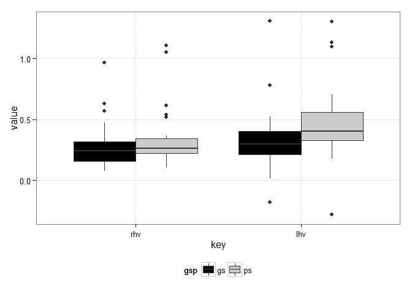
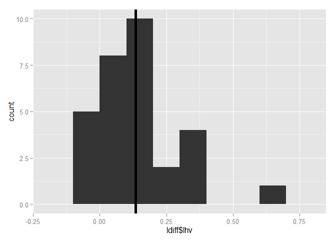
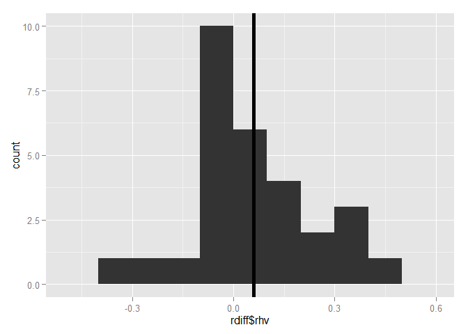

# NRG Additional Figures
#Results
We isolated 163 neurons (94 from S and 69 from U) in NRG while monkeys performed head-unrestrained gaze shifts and gaze pursuit tasks. We chose 51 of these neurons for further analysis in this report, based on apparent head-movement-related activity as perceived by the researchers during recording, and the recording of at least 50 successful trials while isolation was maintained. The behavior tasks that our monkeys performed provided us with a large variety of head movements to investigate. Controlling initial eye position provided us with examples of pursuit and gaze shifts of similar velocities and amplitudes with varying amounts of head contribution. This provided us with the ability to identify neurons with head-related activity during recording. For offline analysis, we can compare the firing rate of the neurons to the actual head and eye kinematics on a trial-by-trial basis. While our focus was on horizontal movements, we recorded the vertical positions of the gaze, eyes and head at all times. 


Since we have preselected our neurons based on apparent task-related activity, we first look for evidence that the rate of activity is correlated with the velocity of head movements. In the following figure, we plot the peak velocity of the head (negative values indicate that the fastest head movement was leftward), and the peak discharge rate of the cell during each trial. We show data observed during all trial types. For pursuit trials, we restrained our search for the peak values to the first trajectory only, to avoid including effects from vertical or oblique movements. 


 

From the figure above, it is apparent that we have a heterogenious sample of neurons. The peak firing rate of many cells never exceeds 200 spikes/s, while some have a peak firing rate greater than 400 spikes/s. There seem to be correlations between the peak head velocity and peak firing rate in many neurons, and this correlation appears to be directionly selective. 

For our first statistical test, we use linear regression to find the relationship between peak head velocity and peak firing rate for each neuron. We fit leftward and rightward movements using separate models. In the figure below, we show an example cell demonstrating this process. Panel 1A shows the head velocity and corresponding activity of the neuron during a fast, leftward head movement, while 1B shows the same during a slower head movement. For each trial, we record the peak head velocity and the peak firing rate of the neuron, which are plotted in 1C. We fit a linear regression model for the relationship between peak firing rate and peak velocity in each direction. For the example neuron shown in 1C, this regression was significant (p<0.001) for leftward movements only. 


In the figure below, we plot the 20 neurons with significant leftward regressions, followed by the 20 cells with signficant rightward regressions. We found that 9 cells had signficant regressions in both directions.


```r
#In this figure, we're showing all the cells with significant regressions for leftward movements
qplot(head_peak,maxsdf*1400,
      data=filter(pp,head_peak< -20,p.left<0.001))+
  facet_wrap(~Neuron,ncol=2)+stat_smooth(method='lm',col='black')+
  stat_smooth_func(method='lm',geom='text',parse=TRUE,hjust=0.3,size=4)+
  theme_bw()+
  ylab('Peak Firing Rate (spikes/s)')+
  xlab('Peak Head Velocity (deg/s)')
```

 


```r
#In this figure, we're showing all the cells with significant regressions for rightward movements
qplot(head_peak,maxsdf*1400,
      data=filter(pp,head_peak > 20,p.right<0.001))+
  facet_wrap(~Neuron,ncol=2)+stat_smooth(method='lm',col='black')+
  stat_smooth_func(method='lm',geom='text',parse=TRUE,hjust=-0.2,size=4)+
  theme_bw()+
  ylab('Peak Firing Rate (spikes/s)')+
  xlab('Peak Head Velocity (deg/s)')
```

 

Of the cells with significant regressions for all head movements, we further tested for the significance of the type of task that was used to elicit the head movements on this relationship. We fit the model $$Fr_{peak} = x_{0}+x_{1} H_{peak}+x_{2} T_{type}+x_{3} H_{peak}*T_{type},$$ where $Fr_{peak}$ is the peak firing rate, $H_{peak}$ is the peak head velocity, and $T_{type}$ is the task  (delayed gaze shift or head-unrestrained pursuit) that was required during each trial,and the $*$ indicates an interaction between the two parameters. A significant $x_{2}$ term indicates a difference in the intercepts for the relationship between peak head velocity and peak firing rate for the trial types, while a significant $x_{3}$ term indicates a difference in slope between the two.  

In the figures below, we plot data from the  5 cells with significant effects of the task type on either the slope or intercept of the fit for leftward head movements, followed by the 7 cells significant during rightward movements.


```r
qplot(head_peak,maxsdf*1400,col=isgs,
      data=filter(pp,head_peak< -20,p.left<0.001,p.left.slope<0.001 | p.left.int<0.001))+
  facet_wrap(~Neuron,ncol=3)+stat_smooth(method='lm')+
  ylab('Peak Firing Rate (spikes/s)')+
  xlab('Peak Head Velocity (deg/s)')+
  theme_bw()+
  scale_colour_grey(start = 0, end = .7,name='Task Type')+
  theme(legend.position='bottom')
```

 


```r
qplot(head_peak,maxsdf*1400,col=isgs,
      data=filter(pp,head_peak> 20,p.right<0.001,p.right.slope<0.001 | p.right.int<0.001))+
  facet_wrap(~Neuron,ncol=3)+stat_smooth(method='lm')+
  ylab('Peak Firing Rate (spikes/s)')+
  xlab('Peak Head Velocity (deg/s)')+
  theme_bw()+
  scale_colour_grey(start = 0, end = .7,name='Task Type')+
  theme(legend.position='bottom')
```

 

Following the methods described above (see Methods: Modeling), for each cell, we generated a model to predict the firing rate of the neuron in terms of eye and head position, velocity and acceleration. Each model includes only terms that increase the R^2^ of the model by 0.05 or more. When describing velocity and position, we typically use negative values to indicate leftward, but for these models, we treat leftward and rightward values as separate variables. The table below shows the resulting best model for each cell, the shift, or latency between neural activity and behavior that provides the best model (measured by R^2^) and the R^2^ of the resulting model compared to the real neural activity.


```r
tab<-xtable(d[,1:4],caption='This table shows the results of a step-wise fitting procedure that with a threshold for inclusion of an increase of 0.5 in the R2')
#print(tab,comment=FALSE)
kable(d[,1:4],digits=2,align='l')
```


Neuron      shift   rsquared   f                        
----------  ------  ---------  -------------------------
SB21Oct11   120     0.77       fr ~ 1 + rhv + rep       
UB21dec11   60      0.70       fr ~ 1 + lep             
UB22may12   70      0.64       fr ~ 1 + rhv + lhv       
SE17Oct11   150     0.58       fr ~ 1 + rhv             
SB10Oct11   170     0.58       fr ~ 1 + rhp + rhv       
UC22may12   80      0.57       fr ~ 1 + rhv + lhv       
SC23Sep11   130     0.47       fr ~ 1 + lhv             
UBA4jun12   90      0.46       fr ~ 1 + rhv + lhv       
SD09Jan12   130     0.41       fr ~ 1 + lhv             
UB23mar12   80      0.40       fr ~ 1 + lhv + rep       
SC12Dec11   70      0.40       fr ~ 1 + lhv             
UB16feb12   90      0.40       fr ~ 1 + lhv             
UB05jan12   60      0.39       fr ~ 1 + lhp + lhv + rha 
SB15Sep11   110     0.37       fr ~ 1 + rhv             
UB28sep11   20      0.35       fr ~ 1 + rhp + rhv + rep 
SD03Nov11   160     0.34       fr ~ 1 + lhv             
SC18Oct11   40      0.33       fr ~ 1 + rhv + lep       
SB16Sep11   70      0.32       fr ~ 1 + lhv             
UD16sep11   130     0.32       fr ~ 1 + lhv             
UB04nov11   70      0.31       fr ~ 1 + rhv + lhv       
UBB4jun12   130     0.30       fr ~ 1 + rhv + lhv       
SB18Oct11   70      0.30       fr ~ 1 + rhv             
UB26mar12   80      0.30       fr ~ 1 + lhv             
UE31oct11   40      0.29       fr ~ 1 + rhv + lhv       
SC21Dec11   130     0.29       fr ~ 1 + lhv             
SC07Oct11   80      0.28       fr ~ 1 + lhp + lhv       
SD13Jan12   190     0.27       fr ~ 1 + lhv             
UC17feb12   100     0.26       fr ~ 1 + lhv + rep       
SC16Sep11   60      0.26       fr ~ 1 + lhv + lep       
UB24oct11   50      0.24       fr ~ 1 + rhv             
UC03jan12   110     0.23       fr ~ 1 + lhv + rep       
UB14may12   100     0.23       fr ~ 1 + rhv + lhv       
SC19Oct11   70      0.22       fr ~ 1 + rhv             
SD30Sep11   200     0.22       fr ~ 1 + rhp + rhv       
SC28Nov11   110     0.21       fr ~ 1 + lhv + lep       
SC14Oct11   180     0.20       fr ~ 1 + rhv             
SD04Jan12   60      0.20       fr ~ 1 + rhv             
SC19Jan12   190     0.20       fr ~ 1 + lhv             
SB28Sep11   50      0.19       fr ~ 1 + rhv + lep       
SD21Sep11   60      0.18       fr ~ 1 + rhv + lhv       
SB05Oct11   80      0.17       fr ~ 1 + rhv + lhv       
SB10Jan12   90      0.17       fr ~ 1 + lhv + lep       
SB30Sep11   130     0.16       fr ~ 1 + rhv             
SB19Jan12   120     0.16       fr ~ 1 + rhv             
SD06Dec11   50      0.15       fr ~ 1 + rhv + lhv       
SB04Nov11   90      0.15       fr ~ 1 + rhv + lhv       
UB07oct11   80      0.14       fr ~ 1 + lhp + rhv       
UB23feb12   50      0.13       fr ~ 1 + rhv             
SD28Sep11   130     0.09       fr ~ 1 + rep             
UB11jan12   40      0.06       fr ~ 1 + lhp             
SB07Oct11   200     0.05       fr ~ 1 + rhv             
SC15Sep11   20      0.00       fr ~ 1                   
UB14dec11   20      0.00       fr ~ 1                   


Breaking down the results shown in the above table, first we show the number of times each variable appears in any of the the final models.

 

It is clear that leftward and rightward head velocity are included more than any other varaibles, but we also see influence of head and eye position in several models. Only one model was improved significantly by the inclusion of head acceleration.

Because head position and eye position are often correlated, we investigate this position-related activity further by isolating the periods of fixation before and after gaze shifts. We fit each cell with a position term included in the stepwise fit above with the model: 

$$Fr = x_{0}+x_{1}H_{R}+x_{2}E_{R}+x_{3}H_{L}+x_{4}E_{L}$$

In the table below, for each neuron, we show the coefficient ($x_{1-4}$) with the greatest value using this method.


  Neuron      Coeficient    Position.Type  
-----------  ------------  ----------------
 UB21dec11       7.97        Leftward.Eye  
 SB28Sep11       2.49       Rightward.Head 
 SB21Oct11       2.07       Rightward.Eye  
 SC18Oct11       1.11       Rightward.Head 
 SB10Oct11       0.97       Rightward.Eye  
 SC28Nov11       0.95       Rightward.Eye  
 UB05jan12       0.87       Rightward.Head 
 SC16Sep11       0.74       Rightward.Eye  
 UB28sep11       0.69       Rightward.Head 
 SC07Oct11       0.48       Rightward.Head 
 UC17feb12       0.47       Rightward.Head 
 UC03jan12       0.44       Rightward.Eye  
 UB23mar12       0.40       Rightward.Head 


The box plot below compares the coefficients for head velocity obtained through linear regression on gaze shift and pursuit trials. We fit each subset individually, using the same formula obtained from applying the stepwiselm function to the entire set.


```r
g<-subset(gs,rsquared>0) #gs loaded in first chunk
tall<-g %>% gather(key,value,c(6,7,8,9,10,12))

#tall$key<-factor(tall$key,levels=c('rhv','lhv','rep','lep','rhp','rha'))
#qplot(value,facets=key~.,data=tall,fill=tall$gsp,binwidth=0.1)+scale_fill_discrete(name="Trial\nType")

tall<-g %>% gather(key,value,c(6,7))
#qplot(value,facets=key~.,data=tall,fill=tall$gsp,binwidth=0.1)+scale_fill_discrete(name="Trial\nType")

qplot(key,value,data=tall,geom='boxplot',fill=gsp)+
  scale_fill_grey(start=0)+
  theme_bw()+
  theme(legend.position = "bottom")
```

 

The plots below show the difference in the fit coefficients for leftward and rightward movements. paired t-tests accompany.


```r
g %>% 
  select(1,5,6) %>% 
  spread(gsp,rhv) %>% 
  mutate(rhv=ps-gs)-> rdiff
g %>% 
  select(1,5,7) %>% 
  spread(gsp,lhv) %>% 
  mutate(lhv=ps-gs)-> ldiff

rd<-t.test(rdiff$rhv)
ld<-t.test(ldiff$lhv)
qplot(ldiff$lhv,binwidth=0.1)+geom_vline(x=ld$estimate,size=2)
```

 

```r
ld
```

```
## 
## 	One Sample t-test
## 
## data:  ldiff$lhv
## t = 4.6735, df = 29, p-value = 6.281e-05
## alternative hypothesis: true mean is not equal to 0
## 95 percent confidence interval:
##  0.07598008 0.19423103
## sample estimates:
## mean of x 
## 0.1351056
```

```r
qplot(rdiff$rhv,binwidth=0.1)+geom_vline(x=rd$estimate,size=2)
```

 

```r
rd
```

```
## 
## 	One Sample t-test
## 
## data:  rdiff$rhv
## t = 1.7753, df = 28, p-value = 0.08672
## alternative hypothesis: true mean is not equal to 0
## 95 percent confidence interval:
##  -0.009332752  0.130658603
## sample estimates:
##  mean of x 
## 0.06066293
```
